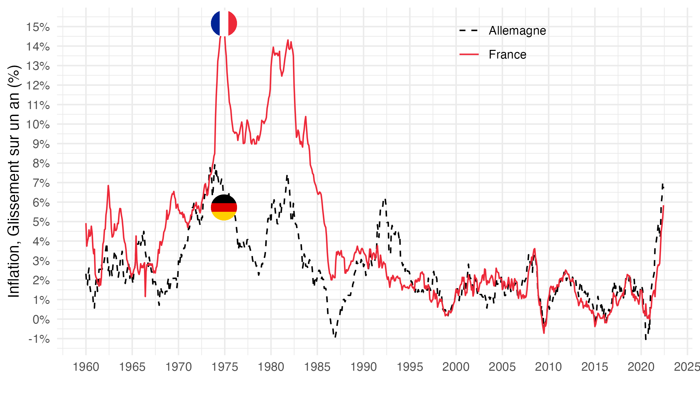
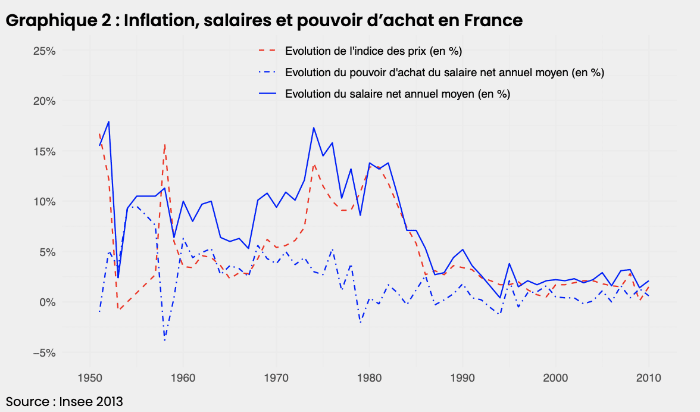

# Inflation et pouvoir d’achat : it’s the politics, stupid !

Ce dépôt met à disposition des codes de réplication pour les graphiques de l'[article](https://lecercledeseconomistes.fr/articles/finance/inflation-et-pouvoir-dachat-its-the-politics-stupid/): Inflation et pouvoir d’achat : _it’s the politics, stupid_ ! 

## Graphique 1: Inflation des prix à la consommation en France et en Allemagne

[Code R](graphique1.R)

## Graphique 2: Inflation, salaires et pouvoir d'achat en France

[Code R](graphique2.R)

