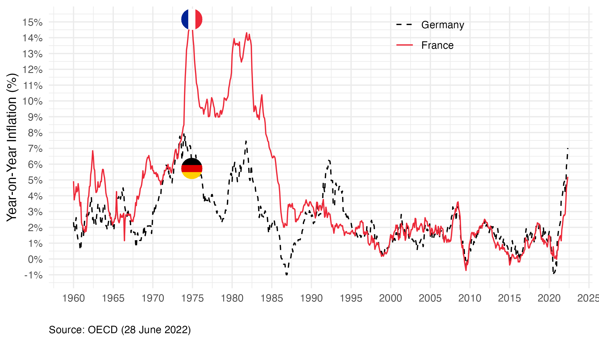
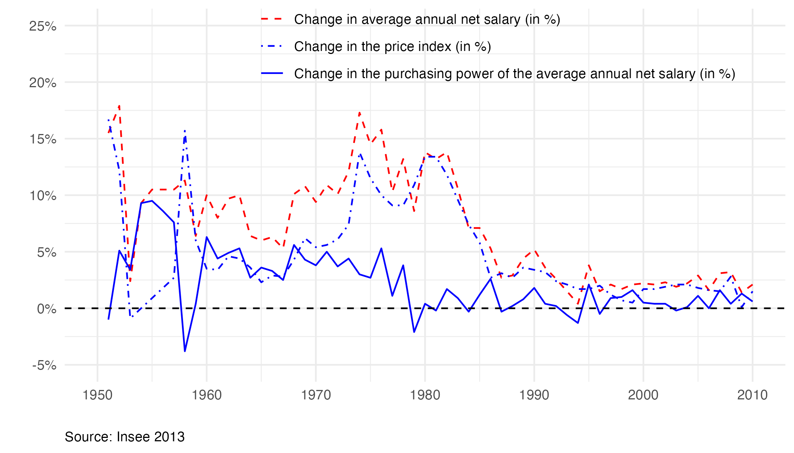

# Inflation and Purchasing Power: It’s the Politics, Stupid!

This repository provides replication code for the figures in the [article](https://fgeerolf.com/inflation-politics.pdf): *Inflation and Purchasing Power: it’s the politics, stupid!*, co-authored with Pierre Jacquet. 

## Figure 1 (figure1.png): Inflation in France and Germany (Consumer Prices)

[R code](figure1.R)

## Figure 2 (figure2.png): Inflation, Wages, and Purchasing Power in France

[R code](figure2.R)

